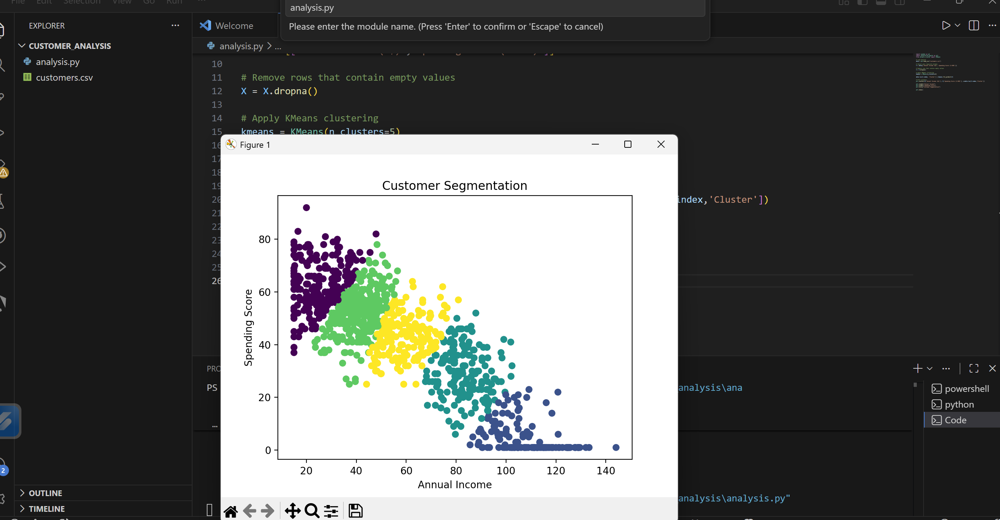

# Customer Segmentation Analysis

This project analyzes customer spending behavior and groups customers into different segments using clustering techniques.

## Project Visualization

## Tools Used
Python  
Pandas  
Matplotlib  
Scikit-learn  

## Objective
Identify different types of customers based on age, annual income, and spending score.

## Dataset
Mall Customer Segmentation Dataset

## Project Structure
Customer-Segmentation-Analysis
│
├── customers.csv
├── customer_segmentation.py
├── README.md
└── result.png

## Author
Umang Singh
